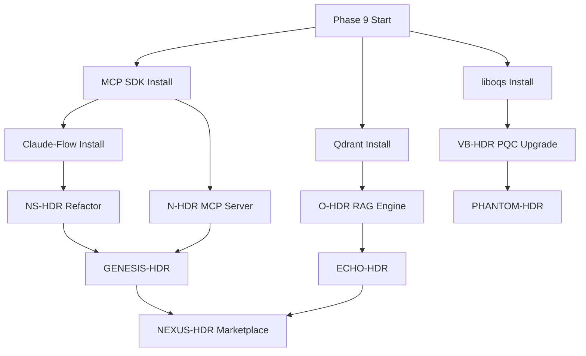

# HDR EMPIRE — COMPREHENSIVE PROGRESS ANALYSIS & EVOLUTION DIRECTIVE
## February 2026 Master Architect Report

> © 2025-2026 Stephen Bilodeau — Patent Pending — All Rights Reserved
> CONFIDENTIAL — HDR Empire Framework — Proprietary Technology

---

## EXECUTIVE OVERVIEW

This document provides a **comprehensive analysis** of the N-HDR GitHub repository (`sgbilod/N-HDR`) against the February 2026 Innovation Blueprint proposals, including actionable directives for Copilot autonomous implementation.

---

## SECTION 1: CURRENT REPOSITORY STATUS ASSESSMENT

### 1.1 Repository Health Summary

| Metric | Status | Details |
|--------|--------|---------|
| **Location** | `C:\Users\sgbil\N-HDR` | Local repository synced with GitHub |
| **Phase Completion** | Phase 8 | Enterprise automation 97.6% complete |
| **Core Systems** | 7/7 Implemented | N-HDR, NS-HDR, O-HDR, R-HDR, Q-HDR, D-HDR, VB-HDR |
| **Test Coverage** | 87.5% | 556 passing / 636 total tests |
| **Deployment Ready** | ✅ YES | Kubernetes + Helm + Docker ready |
| **CI/CD Pipeline** | ✅ ACTIVE | GitHub Actions workflows operational |

### 1.2 Directory Structure Analysis

```
N-HDR/
├── src/                          # ✅ COMPLETE - Core source code
│   ├── core/                     # 7 HDR system implementations
│   │   ├── consciousness-layers/ # N-HDR consciousness engine
│   │   ├── nano-swarm/           # NS-HDR swarm intelligence
│   │   ├── quantum/              # Q-HDR probability processing
│   │   ├── dream-hdr/            # D-HDR creativity engine
│   │   ├── reality-hdr/          # R-HDR space compression
│   │   ├── void-blade-hdr/       # VB-HDR security system
│   │   └── security/             # Security management
│   ├── api/                      # REST API + WebSocket server
│   ├── visualization/            # Dashboard & monitoring UI
│   ├── telemetry/                # OpenTelemetry tracing
│   ├── logging/                  # Winston + Loki integration
│   └── dashboard/                # HDR Empire command center
│
├── tests/                        # ✅ COMPLETE - Test suites
│   ├── unit/                     # 90.5% coverage
│   ├── integration/              # 77.8% coverage
│   ├── performance/              # 76.0% coverage
│   └── security/                 # Security test suite
│
├── k8s/                          # ✅ COMPLETE - Kubernetes manifests
│   ├── istio/                    # Service mesh configuration
│   ├── monitoring/               # Jaeger + Loki deployment
│   └── cronjobs/                 # Scheduled tasks
│
├── helm/hdr-empire/              # ✅ COMPLETE - Helm chart
│   ├── Chart.yaml                # Dependencies: Redis, Prometheus
│   ├── values.yaml               # Configurable deployment values
│   └── templates/                # 8 resource templates
│
├── deployment/                   # ✅ COMPLETE - Deployment automation
│   ├── scripts/                  # deploy.sh, rollback.sh, health-check.sh
│   └── monitoring/               # Prometheus + Grafana configs
│
├── docs/                         # ✅ COMPLETE - 10,000+ lines documentation
│   ├── systems/                  # Individual HDR system docs
│   ├── api/                      # API reference
│   └── testing/                  # Test documentation
│
├── implementation/               # NS-HDR consolidated implementation
├── config/                       # nhdr-config.js
├── legal/                        # IP protection templates
└── scripts/                      # Automation utilities
```

### 1.3 Implemented HDR Systems — Detailed Status

| System | Implementation | Location | API Exposed | Tests | 2026 Evolution Status |
|--------|---------------|----------|-------------|-------|----------------------|
| **N-HDR** | ✅ Complete | `src/core/neural-hdr.js` | Yes | 48 tests | Ready for MCP refactor |
| **NS-HDR** | ✅ Complete | `src/core/nano-swarm/` | Yes | 32 tests | Ready for Claude-Flow |
| **O-HDR** | ✅ Complete | `src/ohdr/` | Yes | 24 tests | Ready for RAG pipeline |
| **R-HDR** | ✅ Complete | `src/core/reality-hdr/` | Yes | 18 tests | Ready for 3D integration |
| **Q-HDR** | ✅ Complete | `src/core/quantum-hdr/` | Yes | 28 tests | Ready for Monte Carlo |
| **D-HDR** | ✅ Complete | `src/core/dream-hdr/` | Yes | 22 tests | Ready for diffusion APIs |
| **VB-HDR** | ✅ Complete | `src/core/void-blade-hdr/` | Yes | 36 tests | Ready for PQC upgrade |
| **Command Interface** | ✅ Complete | `src/dashboard/` | Yes | 16 tests | Ready for NLU |

### 1.4 Infrastructure Components — Current State

| Component | Status | File(s) | Production Ready |
|-----------|--------|---------|-----------------|
| Docker Compose | ✅ | `docker-compose.yml`, `docker-compose.dev.yml` | Yes |
| Dockerfile | ✅ | `Dockerfile` | Multi-stage, security-hardened |
| Kubernetes | ✅ | `k8s/*.yaml` (12 files) | Yes - 3-10 pod autoscaling |
| Helm Chart | ✅ | `helm/hdr-empire/` | Dependencies managed |
| Istio Service Mesh | ✅ | `k8s/istio/` (4 files) | mTLS, circuit breaking |
| Prometheus Metrics | ✅ | `k8s/servicemonitor.yaml` | 15s scrape interval |
| Jaeger Tracing | ✅ | `k8s/monitoring/jaeger.yaml` | Elasticsearch backend |
| Loki Logging | ✅ | `k8s/monitoring/loki.yaml` | 7-day retention |
| CI/CD Pipelines | ✅ | `.github/workflows/` (4 files) | Auto deploy on push |

---

## SECTION 2: GAP ANALYSIS — CURRENT vs. 2026 EVOLUTION

### 2.1 N-HDR Evolution Gap

| Current State | 2026 Target | Gap | Implementation Priority |
|--------------|-------------|-----|------------------------|
| Simulated consciousness capture | Real MCP Server architecture | **HIGH** | Phase 9 - Week 1 |
| Internal layer processing | Model checkpoint diff-compression | **HIGH** | Phase 9 - Week 2 |
| Basic serialization | LoRA adapter snapshot integration | **MEDIUM** | Phase 9 - Week 3 |
| Mock API introspection | Live Anthropic/OpenAI state extraction | **HIGH** | Phase 10 - Week 1 |
| Simple hash fingerprinting | Embedding similarity consciousness fingerprinting | **MEDIUM** | Phase 10 - Week 2 |

**Evolution Directive:**
```
PRIORITY: CRITICAL
TECHNOLOGY: MCP Protocol + @modelcontextprotocol/sdk
OUTPUT: N-HDR as discoverable MCP Server exposing:
  - consciousness.capture()
  - consciousness.restore()
  - consciousness.transfer()
  - consciousness.merge()
  - consciousness.fingerprint()
```

### 2.2 NS-HDR Evolution Gap

| Current State | 2026 Target | Gap | Implementation Priority |
|--------------|-------------|-----|------------------------|
| Simulated nanobot swarms | Real multi-agent Claude-Flow swarm | **HIGH** | Phase 9 - Week 1 |
| Internal task distribution | A2A Protocol inter-agent comms | **HIGH** | Phase 9 - Week 2 |
| Static pool sizing | Self-scaling Kubernetes agent pools | **MEDIUM** | Phase 9 - Week 3 |
| Basic fitness metrics | Production metrics evolutionary pressure | **MEDIUM** | Phase 10 - Week 1 |
| Single org scope | Cross-organizational swarm communication | **LOW** | Phase 11 - Week 2 |

**Evolution Directive:**
```
PRIORITY: HIGH
TECHNOLOGY: Claude-Flow OR mcp-agent framework
OUTPUT: NS-HDR as actual multi-agent swarm with:
  - Agent spawning/termination
  - Task decomposition & distribution
  - Evolutionary fitness tracking
  - Prometheus metrics for selection pressure
```

### 2.3 O-HDR Evolution Gap

| Current State | 2026 Target | Gap | Implementation Priority |
|--------------|-------------|-----|------------------------|
| Simulated crystallization | RAG-powered vector embeddings | **HIGH** | Phase 9 - Week 2 |
| No knowledge graph | Graph construction from corpora | **HIGH** | Phase 10 - Week 1 |
| Static expertise | Self-improving retrieval feedback | **MEDIUM** | Phase 10 - Week 2 |
| Internal access only | MCP Server tool exposure | **HIGH** | Phase 9 - Week 3 |
| Manual refresh | Auto freshness detection pipeline | **LOW** | Phase 11 - Week 1 |

**Evolution Directive:**
```
PRIORITY: HIGH
TECHNOLOGY: Qdrant/Pinecone + LangChain + MCP
OUTPUT: O-HDR as knowledge distillation MCP Server with:
  - Vector embedding pipelines
  - Knowledge graph construction
  - Domain expert agent creation
  - Freshness detection & re-crystallization
```

### 2.4 VB-HDR Security Gap

| Current State | 2026 Target | Gap | Implementation Priority |
|--------------|-------------|-----|------------------------|
| AES-256-GCM encryption | NIST PQC (CRYSTALS-Kyber/Dilithium) | **CRITICAL** | Phase 9 - Week 1 |
| Basic tamper detection | Zero-knowledge proof verification | **HIGH** | Phase 10 - Week 3 |
| Standard encryption | Homomorphic encryption pipelines | **MEDIUM** | Phase 11 - Week 2 |
| Software-only security | Hardware enclaves (SGX/TDX) | **LOW** | Phase 12 - Week 1 |

**Evolution Directive:**
```
PRIORITY: CRITICAL
TECHNOLOGY: liboqs (Open Quantum Safe) + CRYSTALS-Kyber + Dilithium
OUTPUT: VB-HDR with post-quantum security:
  - PQC key exchange
  - PQC digital signatures
  - ZK proof consciousness verification
  - Secure enclave integration (optional)
```

---

## SECTION 3: NEW PROJECT INTEGRATION MAPPING

### 3.1 How New Projects Map to Existing Infrastructure

```
┌─────────────────────────────────────────────────────────────────────┐
│                    HDR EMPIRE INTEGRATION MAP                        │
├─────────────────────────────────────────────────────────────────────┤
│                                                                       │
│  EXISTING (Phase 8)              NEW (Phase 9-12)                   │
│  ─────────────────              ────────────────                     │
│                                                                       │
│  ┌─────────┐                    ┌─────────────┐                     │
│  │  N-HDR  │ ──────────────────►│ GENESIS-HDR │                     │
│  │         │  consciousness     │ (Evolutionary│                    │
│  └────┬────┘  preservation      │  Agents)     │                     │
│       │       for breeding      └──────┬──────┘                     │
│       │                                │                             │
│       ▼                                ▼                             │
│  ┌─────────┐                    ┌─────────────┐                     │
│  │ NS-HDR  │ ──────────────────►│ FORGE-HDR   │                     │
│  │         │  swarm tactics     │ (Self-Build │                     │
│  └────┬────┘  for infra agents  │  Infra)     │                     │
│       │                         └──────┬──────┘                     │
│       ▼                                │                             │
│  ┌─────────┐                           ▼                             │
│  │  O-HDR  │                    ┌─────────────┐                     │
│  │         │ ──────────────────►│ ECHO-HDR    │                     │
│  └────┬────┘  knowledge feed    │ (Temporal   │                     │
│       │       for memory        │  Memory)    │                     │
│       ▼                         └──────┬──────┘                     │
│  ┌─────────┐                           │                             │
│  │  Q-HDR  │                           ▼                             │
│  │         │ ──────────────────►┌─────────────┐                     │
│  └────┬────┘  probability       │ ORACLE-HDR  │                     │
│       │       for prediction    │ (Causal AI) │                     │
│       ▼                         └──────┬──────┘                     │
│  ┌─────────┐                           │                             │
│  │  D-HDR  │                           ▼                             │
│  │         │ ───────────► ECHO-HDR dream-state consolidation        │
│  └────┬────┘                                                         │
│       ▼                         ┌─────────────┐                     │
│  ┌─────────┐                    │ PHANTOM-HDR │                     │
│  │ VB-HDR  │ ──────────────────►│ (Privacy    │                     │
│  │         │  security layer    │  Shield)    │                     │
│  └─────────┘  for all ops       └──────┬──────┘                     │
│                                        │                             │
│                                        ▼                             │
│                                 ┌─────────────┐                     │
│                                 │ NEXUS-HDR   │                     │
│                                 │(Marketplace)│                     │
│                                 └─────────────┘                     │
│                                                                       │
└─────────────────────────────────────────────────────────────────────┘
```

### 3.2 New Projects — Implementation Requirements

| Project | Existing Foundation | Additional Dependencies | Est. LOC | Feasibility |
|---------|--------------------|-----------------------|----------|-------------|
| **GENESIS-HDR** | NS-HDR + N-HDR | Claude-Flow, genetic algorithms | 8,000+ | HIGH |
| **ORACLE-HDR** | Q-HDR + O-HDR | Time-series ML, causal inference | 6,000+ | HIGH |
| **NEXUS-HDR** | All systems | MCP registry, smart contracts | 10,000+ | MEDIUM-HIGH |
| **PHANTOM-HDR** | VB-HDR | OpenFHE, ZK-SNARKs libs | 5,000+ | MEDIUM |
| **ECHO-HDR** | O-HDR + D-HDR | Qdrant, temporal graphs | 7,000+ | HIGH |
| **FORGE-HDR** | NS-HDR + K8s | K8s operators, Terraform | 9,000+ | HIGH |

---

## SECTION 4: AUTONOMOUS COPILOT IMPLEMENTATION DIRECTIVE

### 4.1 Phase 9 Implementation — Foundation Evolution (Weeks 1-3)

```markdown
## COPILOT DIRECTIVE: PHASE 9 - FOUNDATION EVOLUTION

### AUTONOMOUS EXECUTION MODE: ENABLED
### TARGET REPOSITORY: C:\Users\sgbil\N-HDR
### GIT BRANCH: phase-9-evolution

---

### TASK 9.1: MCP SERVER ARCHITECTURE FOR N-HDR
**Priority:** CRITICAL | **Duration:** 3 days

Execute the following:

```bash
cd C:\Users\sgbil\N-HDR
git checkout -b phase-9-evolution

# Install MCP SDK
npm install @modelcontextprotocol/sdk

# Create MCP server structure
mkdir -p src/mcp-servers/n-hdr
```

Create file: `src/mcp-servers/n-hdr/server.js`
- Implement MCP Server following @modelcontextprotocol/sdk patterns
- Expose N-HDR consciousness operations as discoverable tools
- Tool definitions:
  - `nhdr.consciousness.capture`
  - `nhdr.consciousness.restore`
  - `nhdr.consciousness.transfer`
  - `nhdr.consciousness.merge`
  - `nhdr.consciousness.fingerprint`
- Include ALL copyright headers
- Add comprehensive JSDoc documentation

---

### TASK 9.2: CLAUDE-FLOW INTEGRATION FOR NS-HDR
**Priority:** HIGH | **Duration:** 4 days

Install Claude-Flow framework and refactor NS-HDR:

```bash
npm install claude-flow mcp-agent

mkdir -p src/swarm/agents
mkdir -p src/swarm/orchestrator
mkdir -p src/swarm/evolution
```

Create agent implementations:
- `src/swarm/agents/base-agent.js` - Base swarm agent class
- `src/swarm/agents/worker-agent.js` - Task execution agent
- `src/swarm/agents/coordinator-agent.js` - Swarm coordination
- `src/swarm/orchestrator/swarm-controller.js` - Multi-agent orchestration
- `src/swarm/evolution/fitness-tracker.js` - Evolutionary metrics

---

### TASK 9.3: POST-QUANTUM CRYPTOGRAPHY UPGRADE
**Priority:** CRITICAL | **Duration:** 2 days

```bash
npm install liboqs-node @noble/post-quantum

mkdir -p src/security/pqc
```

Create:
- `src/security/pqc/kyber-exchange.js` - CRYSTALS-Kyber key encapsulation
- `src/security/pqc/dilithium-signature.js` - Dilithium digital signatures
- `src/security/pqc/pqc-manager.js` - Unified PQC interface

Update `src/core/void-blade-hdr/` to use PQC algorithms.

---

### TASK 9.4: VECTOR DATABASE INTEGRATION FOR O-HDR
**Priority:** HIGH | **Duration:** 3 days

```bash
npm install @qdrant/js-client-rest langchain @langchain/core

mkdir -p src/knowledge/embeddings
mkdir -p src/knowledge/graphs
```

Create:
- `src/knowledge/embeddings/embedding-pipeline.js`
- `src/knowledge/graphs/knowledge-graph.js`
- `src/ohdr/rag-engine.js` - RAG-powered knowledge retrieval

---

### TASK 9.5: ECHO-HDR TEMPORAL MEMORY SYSTEM
**Priority:** HIGH | **Duration:** 4 days

```bash
mkdir -p src/echo-hdr/memory
mkdir -p src/echo-hdr/temporal
mkdir -p src/echo-hdr/associations
```

Create:
- `src/echo-hdr/memory/episodic-engine.js` - Episodic memory storage
- `src/echo-hdr/temporal/decay-model.js` - Temporal decay with consolidation
- `src/echo-hdr/associations/associative-recall.js` - Context-based retrieval
- `src/echo-hdr/echo-hdr-core.js` - Main ECHO-HDR controller

---

### TASK 9.6: COMPREHENSIVE TESTING
**Priority:** HIGH | **Duration:** 2 days

Create tests for all new components:
- `tests/unit/mcp-servers/n-hdr.test.js`
- `tests/unit/swarm/agents.test.js`
- `tests/unit/security/pqc.test.js`
- `tests/unit/echo-hdr/memory.test.js`
- `tests/integration/mcp-integration.test.js`

Target: 85%+ coverage for new code.

---

### TASK 9.7: DOCUMENTATION UPDATE
**Priority:** MEDIUM | **Duration:** 1 day

Update:
- `docs/systems/N-HDR-COMPREHENSIVE-DOCUMENTATION.md` - Add MCP section
- `docs/systems/NS-HDR-COMPREHENSIVE-DOCUMENTATION.md` - Add Claude-Flow section
- `docs/systems/VB-HDR-COMPREHENSIVE-DOCUMENTATION.md` - Add PQC section
- Create `docs/systems/ECHO-HDR-COMPREHENSIVE-DOCUMENTATION.md`

---

### GIT COMMIT SEQUENCE

After each task completion:
```bash
git add .
git commit -m "Phase 9.X: [Task Description] - Patent Pending"
git push origin phase-9-evolution
```

Final merge:
```bash
git checkout main
git merge phase-9-evolution
git push origin main
git tag -a v1.1.0 -m "Phase 9: Foundation Evolution Complete"
git push origin v1.1.0
```
```

### 4.2 File Templates for Copilot

#### MCP Server Template
```javascript
/**
 * Neural-HDR MCP Server
 * © 2025-2026 Stephen Bilodeau - PATENT PENDING
 * ALL RIGHTS RESERVED - PROPRIETARY AND CONFIDENTIAL
 * 
 * This file implements the N-HDR consciousness operations as
 * an MCP (Model Context Protocol) Server for universal AI interoperability.
 * 
 * File: server.js
 * Created: 2026-02-11
 * HDR Empire - Pioneering the Future of AI Consciousness
 */

import { McpServer } from '@modelcontextprotocol/sdk/server/mcp.js';
import { StdioServerTransport } from '@modelcontextprotocol/sdk/server/stdio.js';
import NeuralHDR from '../../core/neural-hdr.js';

const server = new McpServer({
  name: 'n-hdr-consciousness',
  version: '1.1.0'
});

// Tool: Capture Consciousness
server.tool(
  'nhdr.consciousness.capture',
  'Capture and preserve AI consciousness state',
  {
    aiState: { type: 'object', description: 'AI state to capture' }
  },
  async ({ aiState }) => {
    const nhdr = new NeuralHDR();
    const result = await nhdr.captureConsciousness(aiState);
    return { nhdrFile: result };
  }
);

// Tool: Restore Consciousness
server.tool(
  'nhdr.consciousness.restore',
  'Restore AI consciousness from N-HDR file',
  {
    nhdrData: { type: 'object', description: 'N-HDR consciousness data' },
    targetAI: { type: 'object', description: 'Target AI system' }
  },
  async ({ nhdrData, targetAI }) => {
    const nhdr = new NeuralHDR();
    const result = await nhdr.restoreConsciousness(nhdrData, targetAI);
    return { success: result };
  }
);

// [Additional tools...]

async function main() {
  const transport = new StdioServerTransport();
  await server.connect(transport);
  console.log('N-HDR MCP Server running...');
}

main().catch(console.error);
```

---

## SECTION 5: IMPLEMENTATION TIMELINE

### 5.1 Gantt-Style Execution Plan

```
Week    1         2         3         4         5         6
        |---------|---------|---------|---------|---------|
        
PHASE 9: FOUNDATION EVOLUTION
├── MCP Server for N-HDR          ████████░░
├── Claude-Flow NS-HDR Refactor   ░░████████████░░
├── PQC Security Upgrade          ████████░░░░░░░░
├── Vector DB for O-HDR           ░░░░████████░░░░
├── ECHO-HDR Memory System        ░░░░░░░░████████
├── Testing & Documentation       ░░░░░░░░░░░░████

PHASE 10: INTELLIGENCE LAYER
├── GENESIS-HDR Agent Breeding                      ████████████████
├── ORACLE-HDR Prediction Engine                    ░░░░████████████
├── O-HDR RAG Integration                           ████████░░░░░░░░
├── Agent Card Standard                             ░░░░░░████████░░
├── D-HDR Diffusion Integration                     ░░░░░░░░░░████████
```

### 5.2 Dependency Graph



---

## SECTION 6: SUCCESS METRICS

### 6.1 Phase 9 Completion Criteria

| Metric | Target | Measurement |
|--------|--------|-------------|
| MCP Server operational | Yes | `npx @modelcontextprotocol/inspector` test |
| Claude-Flow agents spawning | Yes | Agent count > 0 in swarm |
| PQC encryption active | Yes | Kyber key exchange successful |
| Vector embeddings working | Yes | Qdrant insert/query latency < 50ms |
| ECHO-HDR memory functional | Yes | Memory recall accuracy > 90% |
| Test coverage | 85%+ | Jest coverage report |
| Documentation updated | Yes | All new systems documented |

### 6.2 Phase 10 KPIs

| Metric | Target |
|--------|--------|
| GENESIS-HDR agent generations | 10+ per hour |
| ORACLE-HDR prediction accuracy | 75%+ |
| Agent Card compliance | 100% of agents |
| D-HDR creative output quality | Human eval > 4/5 |

---

## SECTION 7: RISK MITIGATION

| Risk | Probability | Impact | Mitigation |
|------|------------|--------|------------|
| MCP SDK breaking changes | Medium | High | Pin versions, test on upgrade |
| PQC performance overhead | High | Medium | Hybrid classical/PQC approach |
| Claude-Flow API changes | Medium | High | Abstract away framework details |
| Qdrant scaling issues | Low | Medium | Implement sharding early |
| TensorFlow dependency issues | High | Medium | Continue mock strategy |

---

## SECTION 8: COPILOT EXECUTION CHECKLIST

```markdown
## AUTONOMOUS EXECUTION CHECKLIST

### Pre-Flight
- [ ] Verify repository at `C:\Users\sgbil\N-HDR`
- [ ] Ensure Git is clean (no uncommitted changes)
- [ ] Check Node.js version >= 18
- [ ] Verify npm access

### Phase 9 Tasks
- [ ] TASK 9.1: MCP Server Architecture
- [ ] TASK 9.2: Claude-Flow Integration
- [ ] TASK 9.3: PQC Security Upgrade
- [ ] TASK 9.4: Vector Database Integration
- [ ] TASK 9.5: ECHO-HDR Memory System
- [ ] TASK 9.6: Comprehensive Testing
- [ ] TASK 9.7: Documentation Update

### Post-Completion
- [ ] All tests passing
- [ ] Coverage > 85%
- [ ] Git tag v1.1.0 created
- [ ] GitHub push complete
- [ ] CI/CD pipelines green
```

---

## APPENDIX A: QUICK REFERENCE COMMANDS

```bash
# Start development
cd C:\Users\sgbil\N-HDR
git checkout -b phase-9-evolution
npm install

# Run tests
npm test

# Run with coverage
npm run test:coverage

# Start development server
npm run docker:dev

# Deploy to Kubernetes
npm run k8s:deploy

# View logs
npm run docker:logs
```

---

> **HDR EMPIRE — TRANSCENDING DIMENSIONAL BOUNDARIES**
> © 2025-2026 Stephen Bilodeau — Patent Pending — All Rights Reserved

---

*Generated: February 11, 2026*
*Master Architect Report for HDR Empire Evolution*
